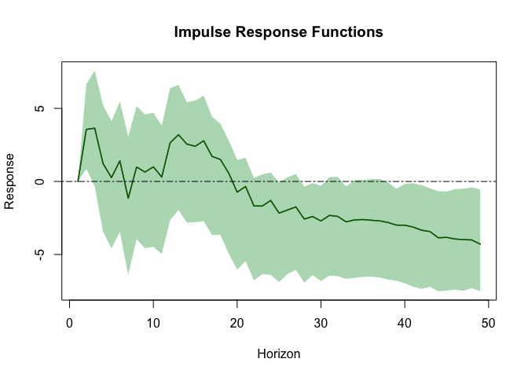

# genDFM

genDFM is a general package to estimate dynamic factor models in R. It
provides a set of functions to estimate the model, plot the components,
and compute forecasts. The package includes a wide range of information
criteria for the choice of factors and allows for the estimation of
Factor Augmented Vector Autoregressions and computation of IRFs. The
core of the package is written in C++ and uses the Armadillo library.

## Installation

You can install the development version of genDFM from GitHub with:

``` r
# install.packages("devtools")
devtools::install_github("radziwanowskii/genDFM")
```

## Load Package

When the package is installed, you can load the package

``` r
library(genDFM)
```

## Show the data

Load the MacroPL dataset and remove the first column containing the
dates

``` r
head(MacroPL)
```

    ##         Date     SBR     SBE     BSB    ExC   ExP     ImC   ImP  Man  Bld   UnE   UnC
    ## 1 2000-02-01  9326.8 12953.6 -3626.8 1306.1  10.6  1910.8   7.9  3.5 29.1  49.7 117.7
    ## 2 2000-03-01 10708.8 12884.9 -2176.1  580.9 -13.4  1532.7 -15.8  1.2 18.2   5.9 116.6
    ## 3 2000-04-01 10004.5 11860.1 -1855.6 -757.1   4.0 -1438.2   0.1 -0.3  8.3 -43.8 117.2
    ## 4 2000-05-01 10807.5 12072.0 -1264.4  437.5  -5.3  2725.5  12.1 -2.1 -2.4 -42.5 118.0
    ## 5 2000-06-01 12482.5 13085.2  -602.8  562.2   5.0 -1213.0 -10.2 -0.5 -3.9  -8.0 117.5
    ## 6 2000-07-01 10575.4 11215.5  -640.1   79.5   4.6  -172.2  -1.1  2.3 -2.9  40.2 117.1
    ##    CPI PFB  PAT  PCF  PHE  PHH   PH   PT   PC  PRC   PE  DPU   TEx   TIm  ToT      M0
    ## 1  0.3 1.2 -0.1 -0.5  0.1 -0.2 -0.5  1.1 -0.5 -0.5 -0.1 6199 101.4 107.4 94.4 -3528.9
    ## 2 -0.1 0.3 -0.2 -0.2 -1.9 -0.2 -0.1  0.8  2.3 -0.2 -0.3 5977  96.4 102.4 94.1  3949.4
    ## 3 -0.5 0.1 -0.1 -0.2  0.7 -0.2 -0.5 -4.1 -7.4 -0.2 -0.2 5360  97.6 103.5 94.3  4134.1
    ## 4  0.2 0.3  0.0 -0.2  0.8 -0.1  0.0  0.2 -2.7 -0.4 -0.3 5955 104.3 108.1 96.5 -1660.3
    ## 5  0.2 0.3 -0.7  0.0  0.8  0.0 -0.7  2.2 -1.3 -0.2  0.0 4991 108.9 111.1 98.0  4180.8
    ## 6  1.4 3.9 -0.5  0.0  0.4 -0.1 -0.1 -1.5 10.2 -0.9  0.1 6463 109.0 110.0 99.1  1787.6
    ##        M1      M2      M3  ERE  ERA  USE  USA  Ref  Lom
    ## 1  -292.2  3579.3  3587.6 4.15 4.14 4.05 4.09 17.5 21.5
    ## 2  -460.3  5166.2  5160.0 4.14 4.09 3.97 3.95 17.5 21.5
    ## 3   933.9  3371.6  3370.7 4.42 4.23 4.02 4.00 17.5 21.5
    ## 4  1927.1  3721.1  3727.6 4.39 4.50 4.09 4.08 17.5 21.5
    ## 5  6068.3 15002.6 15000.5 4.39 4.40 4.21 4.17 17.5 21.5
    ## 6 -4402.1 -7435.7 -7371.2 4.34 4.32 4.01 4.07 17.5 21.5

## Delete the “Date” column and scale the data

``` r
data <- scale(MacroPL[,-1])
```

## Estimate a number of dynamic factors using the information criteria

``` r
genDFM::determine_number_of_dynamic_factors(data, method = "av", max_factors = 10)
```

    ## Number of factors determined by the Avarucci_et_al_2022 test

    ##     factors
    ## IC1       3

## Estimate a dynamic factor model of Forni et. al. (2000) and plot the common component

``` r
dfm <- genDFM::estimate_DFM(data, r = 3, model = "fhlr_2000")
```

    ## Number of factors determined by the Avarucci_et_al_2022 test

``` r
plot(dfm)
```

<!-- -->

## Estimate a factor-augmented vector autoregression

``` r
favar <- genDFM::FAVAR(data, r = 3, n_lags = 13, slow_indices = c(1:22),
                       direct_indices = c('Ref',"Lom"))
```

## Compute impulse response functions

``` r
irf <- genDFM::favar_IRF(favar,shock_variable = "Ref", response_variable = "ERE",
                         n_ahead = 49, n_boot = 500, cumulative = FALSE, 
                         shock = "unit", plot = TRUE, alpha = 0.05)
```

<!-- -->
